# Super Secure - SV US Cyber Open

## Description

I have an uncrackable safe! You must guess the answer to 100 challenge codes to gain access! Unfortunately, I have lost my client program to connect to the safe. Find a way into the safe!

## Files

* [super_secure](<files/super_secure>)

## Solution

The first thing I usually do in a reverse engineering challenge is just run the binary to see how it behaves. Running `super_secure`:

```sh
$ ./super_secure
# Usage: ./super_secure <flag>
$ ./super_secure dummy_flag
# challenge: G!,bObn9:46UyWJ{}\dadCTkW!qZApmh-5f\wW14kH%";O::-:{-^QyQR(.sx7x'
> 1
# Challenge failed :(
# Correct: 6482367484271249170 Incorrect: 1
```

It appears the binary produces 64 bytes of text, then asks for some sort of value based on challenge provided. This challenge changes every time the process is executed, and there is a unique correct value, indicating that there is likely some randomization at play in its outputs.

Now that we know what the binary does at a high level, onto decompilation!

To get some info about the file:
```sh
$ file super_secure
# files/super_secure: ELF 64-bit LSB pie executable, x86-64, version 1 (SYSV), dynamically linked, interpreter /lib64/ld-linux-x86-64.so.2, BuildID[sha1]=fcb05da2e8bcb308e42d465040a7eda173244300, for GNU/Linux 3.2.0, stripped
```

`Stripped` doesn't help, but it's mostly expected for the challenge. No debug symbols means it's Ghidra time!

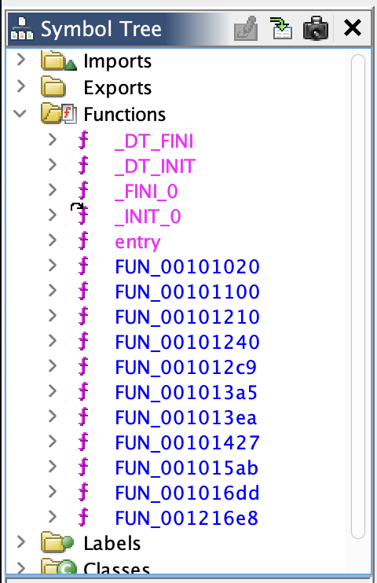

Not much to go off here, but we do have an entrypoint.

```c
void processEntry entry(undefined8 param_1,undefined8 param_2)

{
  undefined1 auStack_8 [8];
  
  __libc_start_main(FUN_001015ab,param_2,&stack0x00000008,0,0,param_1,auStack_8);
  do {
                      /* WARNING: Do nothing block with infinite loop */
  } while( true );
}
```

It appears `FUN_001015ab` is our `main`, so we'll note it down as such and take a look at its decompilation. While we're here, let's look at the function graph:

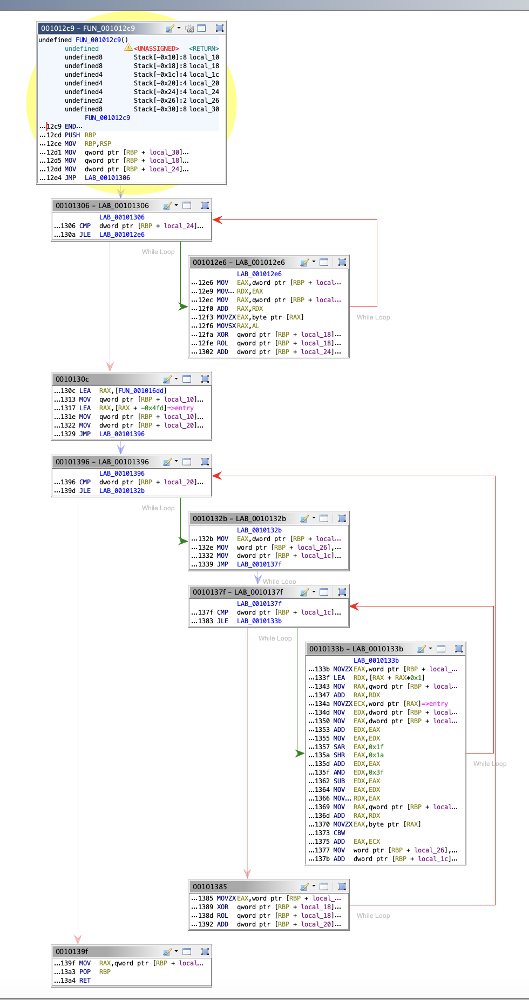

This is super useful, since we can see the full flow of the binary at a glance, just for context.

### `main`

```c
/* WARNING: Globals starting with '_' overlap smaller symbols at the same address */

undefined8 FUN_001015ab(int param_1,undefined8 *param_2)

{
  int iVar1;
  undefined8 uVar2;
  time_t tVar3;
  int local_10;
  int local_c;
  
  if (param_1 < 2) {
    printf("Usage: %s <flag>",*param_2);
    uVar2 = 1;
  }
  else {
    iVar1 = mprotect(_DT_INIT,0x24000,7);
    if (iVar1 != 0) {
      perror("mprotect");
                      /* WARNING: Subroutine does not return */
      exit(1);
    }
    srand(0x13371337);
    for (local_10 = 0; local_10 < 0xffff; local_10 = local_10 + 1) {
      iVar1 = rand();
      *(short *)(FUN_001016dd + (long)local_10 * 2) = (short)iVar1;
    }
    _FUN_001216e8 = _FUN_001016dd;
    tVar3 = time((time_t *)0x0);
    srand((uint)tVar3 ^ 0x1015ab);
    for (local_c = 0; local_c < 100; local_c = local_c + 1) {
      FUN_00101427();
    }
    printf("Congratulations: %s",param_2[1]);
    uVar2 = 0;
  }
  return uVar2;
}
```

Lots of curious stuff happening here! One of the first things that's apparent is our `printf` call that shows the flag, right after 100 calls to `FUN_00101427`. This indicates that `FUN_00101427` probably handles challenge generation. `param_2` comes directly from the command-line arguments, and it doesn't look like there's much we can do to leak it apart from getting to the `printf` call.

The next thing we notice is the `mprotect` call. Personally, I had not seen this before, so after a bit of research we can figure out what `mprotect(_DT_INIT,0x24000,7)` does. From the [manpage](https://man7.org/linux/man-pages/man2/mprotect.2.html):

```
int mprotect(void addr[.size], size_t size, int prot);

mprotect() changes the access protections for the calling
process's memory pages containing any part of the address range in
the interval [addr, addr+size-1].  addr must be aligned to a page
boundary.

If the calling process tries to access memory in a manner that
violates the protections, then the kernel generates a SIGSEGV
signal for the process.

prot is a combination of the following access flags: PROT_NONE or
a bitwise OR of the other values in the following list:

PROT_NONE
        The memory cannot be accessed at all.

PROT_READ
        The memory can be read.

PROT_WRITE
        The memory can be modified.

PROT_EXEC
        The memory can be executed.
```

Very interesting! It seems like we're calling `mprotect` starting at `_DT_INIT`, which is probably the start of the process memory, with a size of `0x24000` and protections bitfield of `7`, or `0b111`, meaning we're enabling RWX permissions. **This means that the process can edit its own `.text` region!** Interesting revelation for sure, and it'll likely play a role later.

After that, we get to 

```c
srand(0x13371337);
for (local_10 = 0; local_10 < 0xffff; local_10 = local_10 + 1) {
    iVar1 = rand();
    *(short *)(FUN_001016dd + (long)local_10 * 2) = (short)iVar1;
}
```

This looks important! We seed the PRNG with `0x13371337`, then generate 0xffff (65535) values from the `rand()` function. It appears that this is getting written directly into the code sector, since Ghidra is referencing a pointer to `FUN_001016dd`, and calculating offsets based on that. It's also important to note that we are only using shorts here, so we're writing 2 bytes for each random number.

Moving along, it appears we make a copy of the FUN_001016dd pointer in `_FUN_001216e8` (maybe not a perfect decompilation here), then some more references to the PRNG:

```c
tVar3 = time((time_t *)0x0);
srand((uint)tVar3 ^ 0x1015ab);
```

The binary reseeds with the current system time, meaning that any future random number generations will be much harder to predict (though we may be able to get a subset of possible seeds since we know when we connect to the remote server, this is by no means exact).

And that's the main function!

Let's fully annotate it:

```c
undefined8 main(int param_1,undefined8 *flag)

{
  int temp;
  undefined8 uVar1;
  time_t temp2;
  int i;
  int j;
  
  if (param_1 < 2) {
    printf("Usage: %s <flag>",*flag);
    uVar1 = 1;
  }
  else {
    // mprotect
    temp = mprotect(_DT_INIT,0x24000,7);
    if (temp != 0) {
      perror("mprotect");
      exit(1);
    }

    // generate table of random values
    srand(0x13371337);
    for (i = 0; i < 0xffff; i = i + 1) {
      temp = rand();
      *(short *)(table + (long)i * 2) = (short)temp;
    }

    // ?
    _FUN_001216e8 = _table;

    // reseed with system time
    temp2 = time((time_t *)0x0);
    srand((uint)temp2 ^ 0x1015ab);

    // do the challenge!
    for (j = 0; j < 100; j = j + 1) {
      do_challenge();
    }

    printf("Congratulations: %s",flag[1]);
    uVar1 = 0;
  }
  return uVar1;
}
```

### `do_challenge`

Now, let's move on to `FUN_00101427`, which we've noted is what actually generates challenges.

```c
undefined8 FUN_00101427(void)

{
  int iVar1;
  long in_FS_OFFSET;
  int local_6c;
  long local_68;
  long local_60;
  byte local_58 [72];
  long local_10;
  
  local_10 = *(long *)(in_FS_OFFSET + 0x28);
  local_58[0] = 0;
  local_58[1] = 0;
  local_58[2] = 0;
  local_58[3] = 0;
  local_58[4] = 0;
  // ...
  local_58[0x3e] = 0;
  local_58[0x3f] = 0;
  local_58[0x40] = 0;
  
  for (local_6c = 0; local_6c < 0x40; local_6c = local_6c + 1) {
    iVar1 = rand();
    local_58[local_6c] = (char)iVar1 + (char)(iVar1 / 0x5e) * -0x5e + 0x20U ^ local_58[local_6c];
  }
  printf("challenge: %s\n>",local_58);
  fflush(stdout);
  _FUN_001016dd = 0;
  signal(0xe,FUN_001013ea);
  ualarm(5000,0);
  __isoc99_scanf(&DAT_00122018,&local_68);
  local_60 = FUN_001012c9(local_58);
  if (local_60 != local_68) {
    printf("Challenge failed :(\nCorrect: %llu Incorrect: %llu\n",local_60,local_68);
                      /* WARNING: Subroutine does not return */
    exit(0);
  }
  if (local_10 != *(long *)(in_FS_OFFSET + 0x28)) {
                      /* WARNING: Subroutine does not return */
    __stack_chk_fail();
  }
  return 0;
}
```

We immediately see the text that we initially saw when running the binary for the first time, so we know we're in the right place. Specifically, the following snippet gives us a great clue as to what to look at:

```c
__isoc99_scanf(&DAT_00122018,&local_68);
local_60 = FUN_001012c9(local_58);
if (local_60 != local_68) {
  printf("Challenge failed :(\nCorrect: %llu Incorrect: %llu\n",local_60,local_68);
                    /* WARNING: Subroutine does not return */
  exit(0);
}
```

This indicates that local_60 is what we're trying to match with our input, and `FUN_001012c9` is what generates the correct value. Let's note that down for now, and we'll come back to it later.

`local_58` is zeroed out from 0 to 0x40 (64), so that seems like a good candidate for what stores our challenge data, since we know it should be 64 bytes long.

```c
for (local_6c = 0; local_6c < 0x40; local_6c = local_6c + 1) {
  iVar1 = rand();
  local_58[local_6c] = (char)iVar1 + (char)(iVar1 / 0x5e) * -0x5e + 0x20U ^ local_58[local_6c];
}
printf("challenge: %s\n>",local_58);
```
To generate our actual challenge, it appears that the binary just generates a new random number, then clamps it to the printable character set. This then gets shown to the user directly, and it later gets passed into the validation function. This suggest that we don't need to do much work around figuring out what the binary *will* generate, we mainly just need to figure out how it generates its correct values.

Now we get to the next part of the function, which I initially somewhat ignored while solving the challenge, and moved onto the actual challenge validation steps.

```c
_FUN_001016dd = 0;
signal(0xe,FUN_001013ea);
ualarm(5000,0);
```

We'll talk about this more later, but foreshadowing for now: this breaks a lot of the future rev we attempt!

We can annotate `do_challenge` to look like this:

```c

/* WARNING: Globals starting with '_' overlap smaller symbols at the same address */

undefined8 do_challenge(void)

{
  int iVar1;
  long in_FS_OFFSET;
  int i;
  long user_val;
  long local_60;
  byte challenge [72];
  long stack_canary;
  
  // looks like a stack canary, ignore
  stack_canary = *(long *)(in_FS_OFFSET + 0x28);

  challenge[0] = 0;
  challenge[1] = 0;
  challenge[2] = 0;
  challenge[3] = 0;
  challenge[4] = 0;
  // ...
  challenge[0x3e] = 0;
  challenge[0x3f] = 0;
  challenge[0x40] = 0;

  // create challenge bytes
  for (i = 0; i < 64; i = i + 1) {
    iVar1 = rand();
    challenge[i] = (char)iVar1 + (char)(iVar1 / 0x5e) * -0x5e + 0x20U ^ challenge[i];
  }

  printf("challenge: %s\n>",challenge);
  fflush(stdout);

  // ignore for now
  _table = 0;
  signal(0xe,FUN_001013ea);
  ualarm(5000,0);

  // user input for their answer
  __isoc99_scanf(&DAT_00122018,&user_val);
  correct_val = validate_challenge(challenge);
  if (correct_val != user_val) {
    printf("Challenge failed :(\nCorrect: %llu Incorrect: %llu\n",correct_val,user_val);
                      /* WARNING: Subroutine does not return */
    exit(0);
  }
  if (stack_canary != *(long *)(in_FS_OFFSET + 0x28)) {
                      /* WARNING: Subroutine does not return */
    __stack_chk_fail();
  }
  return 0;
}
```

### `validate_challenge`

This function is significantly more obfuscated than the previous one, and Ghidra does not decompile it amazingly. Let's look at the output:

```c
ulong FUN_001012c9(long param_1)

{
  ushort local_26;
  int local_24;
  int local_20;
  int local_1c;
  ulong local_18;
  
  local_18 = 0;
  for (local_24 = 0; local_24 < 0x40; local_24 = local_24 + 1) {
    local_18 = local_18 ^ (long)*(char *)(param_1 + local_24);
    local_18 = local_18 << 1 | (ulong)((long)local_18 < 0);
  }
  for (local_20 = 0; local_20 < 0x10000; local_20 = local_20 + 1) {
    local_26 = (ushort)local_20;
    for (local_1c = 0; local_1c < 3; local_1c = local_1c + 1) {
      local_26 = (short)*(char *)(param_1 + (local_20 + local_1c) % 0x40) +
                   *(short *)(entry + (ulong)local_26 * 2);
    }
    local_18 = (local_18 ^ local_26) << 0x10 | local_18 >> 0x30;
  }
  return local_18;
}
```

At this point, it's a good idea to take a look at other decompilers just for reference, so here's an output from IDA:

```c
unsigned __int64 __fastcall sub_12C9(__int64 a1)
{
  unsigned __int16 v2; // [rsp+Ah] [rbp-1Eh]
  int i; // [rsp+Ch] [rbp-1Ch]
  int j; // [rsp+10h] [rbp-18h]
  int k; // [rsp+14h] [rbp-14h]
  unsigned __int64 v6; // [rsp+18h] [rbp-10h]

  v6 = 0;
  for ( i = 0; i <= 63; ++i )
    v6 = __ROL8__(*(char *)(i + a1) ^ v6, 1);
  for ( j = 0; j <= 0xFFFF; ++j )
  {
    v2 = j;
    for ( k = 0; k <= 2; ++k )
      v2 = *(_WORD *)((char *)sub_16DD + 2 * v2 - 1277) + *(char *)((k + j) % 64 + a1);
    v6 = __ROL8__(v2 ^ v6, 16);
  }
  return v6;
}
```

A few things look pretty different! We'll use the IDA output occasionally for reference, but for now, let's look at Ghidra.

Within the main function body, there are two loops that both operate on `local_18`, which is returned, so we can infer that this is the output result from the operation. The function takes in the contents of the challenge as well, stored in `param_1`. It appears that the first loop, repeated below, solely operates based on the challenge and a few stack variables.


Let's annotate what we know thus far:

```c
result = 0;
for (i = 0; i < 0x40; i = i + 1) {
  result = result ^ (long)*(char *)(challenge_bytes + i);
  result = result << 1 | (ulong)((long)result < 0);
}
for (j = 0; j < 0x10000; j = j + 1) {
  j_short = (ushort)j;
  for (k = 0; k < 3; k = k + 1) {
    j_short = (short)*(char *)(challenge_bytes + (j + k) % 0x40) +
                  *(short *)(entry + (ulong)j_short * 2);
  }
  result = (result ^ j_short) << 0x10 | result >> 0x30;
}
return result;
```

At this point, I assumed that Ghidra's disassembly was mistaken (it wouldn't be the first time), since why would be reading from the `entry` function as a memory address? Haha.

Trying to make sense of what's going on here, the first loop performs some sort of operation (I know, very clear) on the result with each of the individaul challenge bytes (since it runs 0x40 times), and we're left with a numeric result. The second loop executes 65536 times, which notably is very close to the number of random numbers we have generated in our table at the start! We can probably assume that this uses those random numbers in some way, and folds them into the final result as well.

Let's recap everything we know about the binary thus far:

1. Calls `mprotect` to make its code section writable
2. Seeds the PRNG with `0x13371337`, then generates 65535 shorts
3. Reseeds the PRNG with the current system time
4. Enters the main challenge loop
5. Generates a 64-byte challenge using the same PRNG
6. Receives user input value
7. Computes value based on challenge, using random number table generated previously
8. If values are identical, moves onto the next challenge until the flag is printed; otherwise, exits

The validator seems reasonable to rewrite in Python, so let's try that. I wanted to split this up into stages 1 and 2, in order to make it easier to verify the results against the real validator in a debugger (this is what led to a pretty big rabbithole, we'll get to that...)

After some more research and a bit of help from AI tools, we can deduce that the first loop XORs the result with the character value of each byte, and rotates the entire result left 1 bit, preserving the sign. We also `&` the result with `MASK64` at each step to ensure that the number stays within 64 bits to emulate the binary.

```py
import ctypes

def solve_stage1(challenge_bytes: bytes) -> int:
  result = 0
  MASK64 = 0xFFFFFFFFFFFFFFFF

  for i in range(64):
      signed_char_val = ctypes.c_byte(challenge_bytes[i]).value
      result ^= signed_char_val
      result &= MASK64

      high_bit = (result >> 63) & 1
      result = ((result << 1) | high_bit) & MASK64

  return result
```

Let's test it!

### GDB

We'll need the assembly to look at as well for stage 2 anyway, and it helps us understand what's fully going on with this function.

```assembly
001012cd 55              PUSH       RBP
001012ce 48 89 e5        MOV        RBP,RSP
001012d1 48 89 7d d8     MOV        qword ptr [RBP + local_30],input_bytes
001012d5 48 c7 45        MOV        qword ptr [RBP + result],0x0
          f0 00 00 
          00 00
001012dd c7 45 e4        MOV        dword ptr [RBP + idx],0x0
          00 00 00 00
001012e4 eb 20           JMP        LAB_00101306
                      LAB_001012e6                                    XREF[1]:     0010130a(j)  
001012e6 8b 45 e4        MOV        EAX,dword ptr [RBP + idx]
001012e9 48 63 d0        MOVSXD     RDX,EAX
001012ec 48 8b 45 d8     MOV        RAX,qword ptr [RBP + local_30]
001012f0 48 01 d0        ADD        RAX,RDX
001012f3 0f b6 00        MOVZX      EAX,byte ptr [RAX]
001012f6 48 0f be c0     MOVSX      RAX,AL
001012fa 48 31 45 f0     XOR        qword ptr [RBP + result],RAX
001012fe 48 d1 45 f0     ROL        qword ptr [RBP + result],0x1
00101302 83 45 e4 01     ADD        dword ptr [RBP + idx],0x1
                      LAB_00101306                                    XREF[1]:     001012e4(j)  
00101306 83 7d e4 3f     CMP        dword ptr [RBP + idx],0x3f
0010130a 7e da           JLE        LAB_001012e6
0010130c 48 8d 05        LEA        RAX,[table]
          ca 03 00 00
00101313 48 89 45 f8     MOV        qword ptr [RBP + local_10],RAX=>table
00101317 48 8d 80        LEA        RAX,[RAX + -0x4fd]=>entry
          03 fb ff ff
0010131e 48 89 45 f8     MOV        qword ptr [RBP + local_10],RAX=>entry
00101322 c7 45 e8        MOV        dword ptr [RBP + jdx],0x0
          00 00 00 00
00101329 eb 6b           JMP        LAB_00101396
                      LAB_0010132b                                    XREF[1]:     0010139d(j)  
0010132b 8b 45 e8        MOV        EAX,dword ptr [RBP + jdx]
0010132e 66 89 45 e2     MOV        word ptr [RBP + jdx_short],AX
00101332 c7 45 ec        MOV        dword ptr [RBP + kdx],0x0
          00 00 00 00
00101339 eb 44           JMP        LAB_0010137f
                      LAB_0010133b                                    XREF[1]:     00101383(j)  
0010133b 0f b7 45 e2     MOVZX      EAX,word ptr [RBP + jdx_short]
0010133f 48 8d 14 00     LEA        RDX,[RAX + RAX*0x1]
00101343 48 8b 45 f8     MOV        RAX,qword ptr [RBP + local_10]
00101347 48 01 d0        ADD        RAX,RDX
0010134a 0f b7 08        MOVZX      ECX,word ptr [RAX]=>entry
0010134d 8b 55 e8        MOV        EDX,dword ptr [RBP + jdx]
00101350 8b 45 ec        MOV        EAX,dword ptr [RBP + kdx]
00101353 01 c2           ADD        EDX,EAX
00101355 89 d0           MOV        EAX,EDX
00101357 c1 f8 1f        SAR        EAX,0x1f
0010135a c1 e8 1a        SHR        EAX,0x1a
0010135d 01 c2           ADD        EDX,EAX
0010135f 83 e2 3f        AND        EDX,0x3f
00101362 29 c2           SUB        EDX,EAX
00101364 89 d0           MOV        EAX,EDX
00101366 48 63 d0        MOVSXD     RDX,EAX
00101369 48 8b 45 d8     MOV        RAX,qword ptr [RBP + local_30]
0010136d 48 01 d0        ADD        RAX,RDX
00101370 0f b6 00        MOVZX      EAX,byte ptr [RAX]
00101373 66 98           CBW
00101375 01 c8           ADD        EAX,ECX
00101377 66 89 45 e2     MOV        word ptr [RBP + jdx_short],AX
0010137b 83 45 ec 01     ADD        dword ptr [RBP + kdx],0x1
                      LAB_0010137f                                    XREF[1]:     00101339(j)  
0010137f 83 7d ec 02     CMP        dword ptr [RBP + kdx],0x2
00101383 7e b6           JLE        LAB_0010133b
00101385 0f b7 45 e2     MOVZX      EAX,word ptr [RBP + jdx_short]
00101389 48 31 45 f0     XOR        qword ptr [RBP + result],RAX
0010138d 48 c1 45        ROL        qword ptr [RBP + result],0x10
          f0 10
00101392 83 45 e8 01     ADD        dword ptr [RBP + jdx],0x1
                      LAB_00101396                                    XREF[1]:     00101329(j)  
00101396 81 7d e8        CMP        dword ptr [RBP + jdx],65535
          ff ff 00 00
0010139d 7e 8c           JLE        LAB_0010132b
0010139f 48 8b 45 f0     MOV        RAX,qword ptr [RBP + result]
001013a3 5d              POP        RBP
001013a4 c3              RET
```

This isn't amazingly useful right now, but Ghidra does give us helpful hints as to what calls are referencing which stack variables, which is nice to have while debugging in GDB.

Let's get started!

```
gef➤  info proc mappings
process 2334988
Mapped address spaces:

          Start Addr           End Addr       Size     Offset  Perms  objfile
      0x555555554000     0x555555555000     0x1000        0x0  r--p   /home/_/super_secure
      0x555555555000     0x555555577000    0x22000     0x1000  rwxp   /home/_/super_secure
      0x555555577000     0x555555579000     0x2000    0x22000  rwxp   /home/_/super_secure
      0x555555579000     0x55555559a000    0x21000        0x0  rw-p   [heap]
      0x7ffff7c00000     0x7ffff7c28000    0x28000        0x0  r--p   /usr/lib/x86_64-linux-gnu/libc.so.6
      0x7ffff7c28000     0x7ffff7db0000   0x188000    0x28000  r-xp   /usr/lib/x86_64-linux-gnu/libc.so.6
      0x7ffff7db0000     0x7ffff7dff000    0x4f000   0x1b0000  r--p   /usr/lib/x86_64-linux-gnu/libc.so.6
      0x7ffff7dff000     0x7ffff7e03000     0x4000   0x1fe000  r--p   /usr/lib/x86_64-linux-gnu/libc.so.6
      0x7ffff7e03000     0x7ffff7e05000     0x2000   0x202000  rw-p   /usr/lib/x86_64-linux-gnu/libc.so.6
      0x7ffff7e05000     0x7ffff7e12000     0xd000        0x0  rw-p
      0x7ffff7faf000     0x7ffff7fb2000     0x3000        0x0  rw-p
      0x7ffff7fbd000     0x7ffff7fbf000     0x2000        0x0  rw-p
      0x7ffff7fbf000     0x7ffff7fc3000     0x4000        0x0  r--p   [vvar]
      0x7ffff7fc3000     0x7ffff7fc5000     0x2000        0x0  r-xp   [vdso]
      0x7ffff7fc5000     0x7ffff7fc6000     0x1000        0x0  r--p   /usr/lib/x86_64-linux-gnu/ld-linux-x86-64.so.2
      0x7ffff7fc6000     0x7ffff7ff1000    0x2b000     0x1000  r-xp   /usr/lib/x86_64-linux-gnu/ld-linux-x86-64.so.2
      0x7ffff7ff1000     0x7ffff7ffb000     0xa000    0x2c000  r--p   /usr/lib/x86_64-linux-gnu/ld-linux-x86-64.so.2
      0x7ffff7ffb000     0x7ffff7ffd000     0x2000    0x36000  r--p   /usr/lib/x86_64-linux-gnu/ld-linux-x86-64.so.2
      0x7ffff7ffd000     0x7ffff7fff000     0x2000    0x38000  rw-p   /usr/lib/x86_64-linux-gnu/ld-linux-x86-64.so.2
      0x7ffffffde000     0x7ffffffff000    0x21000        0x0  rw-p   [stack]
  0xffffffffff600000 0xffffffffff601000     0x1000        0x0  --xp   [vsyscall]
```
Here, we can see that our binary is mappped to 0x555555555000, crucially with perms `rwxp` from the `mprotect` call!

From the assembly, we can see that 0x001012cd is where the function starts, so let's try to disassemble that region in the process, at `0x5555555552cd`.

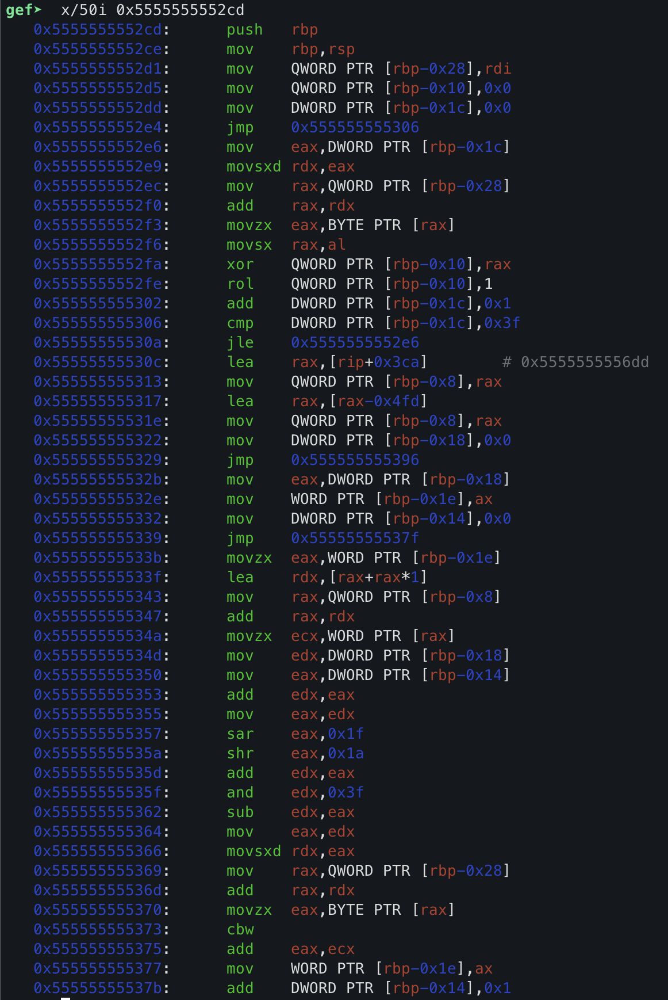

Awesome! This matches our Ghidra disassembly, so we know we're in the right place. Let's set a breakpoint there:

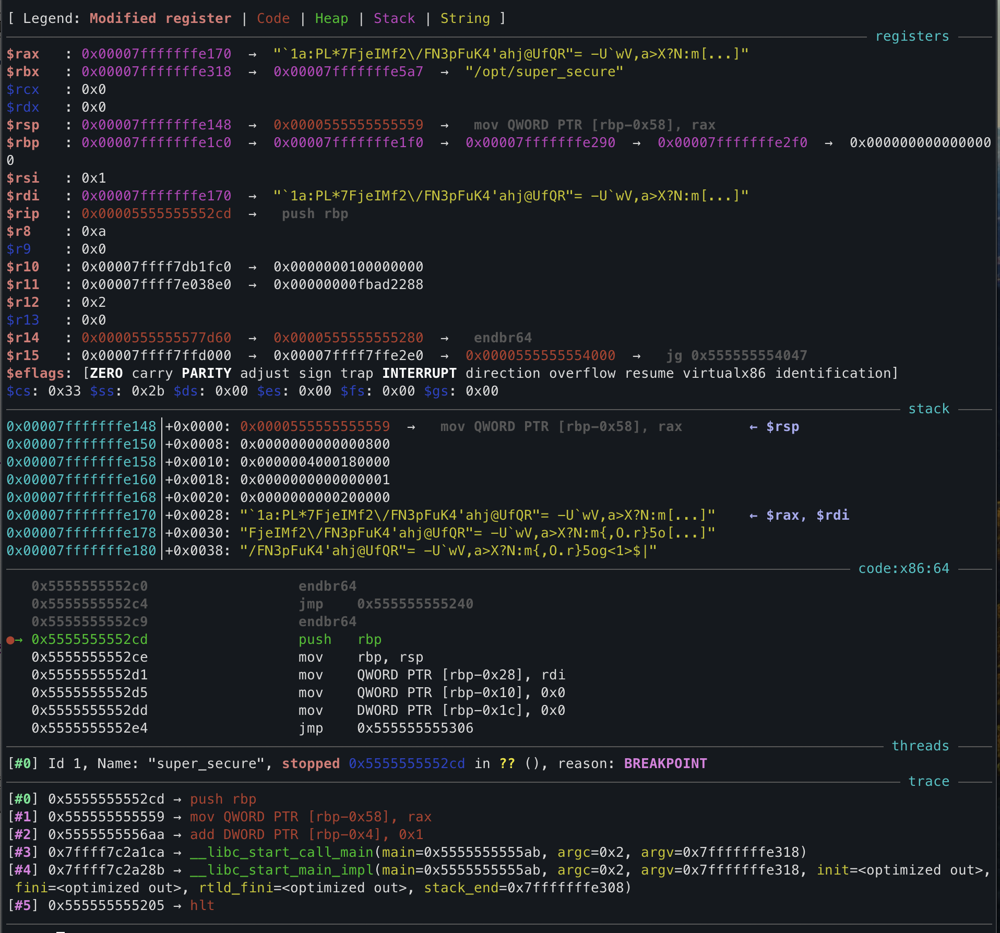

The GEF plugin makes this much nicer to work with, since we can see the registers, stack, and instructions at a glance.

The body of the first loop lives here:

```
0x5555555552e6:	mov    eax,DWORD PTR [rbp-0x1c]
0x5555555552e9:	movsxd rdx,eax
0x5555555552ec:	mov    rax,QWORD PTR [rbp-0x28]
0x5555555552f0:	add    rax,rdx
0x5555555552f3:	movzx  eax,BYTE PTR [rax]
0x5555555552f6:	movsx  rax,al
0x5555555552fa:	xor    QWORD PTR [rbp-0x10],rax
0x5555555552fe:	rol    QWORD PTR [rbp-0x10],1
0x555555555302:	add    DWORD PTR [rbp-0x1c],0x1
```

Surprisingly enough, this looks much simpler than the Ghidra disassembly! We can clearly see the `xor` and `rol` right after each other, without having to parse through the mess of operators Ghidra produced. 

If we copy a challenge and test this, we can execute through this loop by setting a breakpoint on 0x55555555530c, since this is directly after the `jle` instruction to jump back into the loop until we've finished 64 executions.

To print the value of the result at this point, we can run:

```
p/u *(unsigned long long*)($rbp - 0x10)
```

We know that the value is at `$rbp-0x10` since 0x5555555552fa and 2fe show that the binary is XORing and applying the `rol` on that address, which tracks with the disassembly we have.

Now with our breakpoint set, we can copy the generated challenge (in this case, `?iG#%Sv|;IdG,PL<a\_HG?h^2pq6Ww?v|f6>UHVqq<T )"<&y7i\VS<$_I:8CYJA`, what a mouthful) and test it against our Python version!

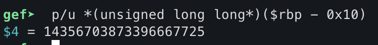

```sh
$ python3 solve.py
# 14356703873396667725
```

Perfect, stage 1 is done! This wasn't strictly necessary, but it's a good sanity check for later.

Now, let's analyze what comes right after this. Everything on and after 0x55555555530c is related to the second set of loops:

```
=> 0x55555555530c:	lea    rax,[rip+0x3ca]        # 0x5555555556dd
   0x555555555313:	mov    QWORD PTR [rbp-0x8],rax
   0x555555555317:	lea    rax,[rax-0x4fd]
   0x55555555531e:	mov    QWORD PTR [rbp-0x8],rax
   0x555555555322:	mov    DWORD PTR [rbp-0x18],0x0
   0x555555555329:	jmp    0x555555555396
   0x55555555532b:	mov    eax,DWORD PTR [rbp-0x18]
   0x55555555532e:	mov    WORD PTR [rbp-0x1e],ax
   0x555555555332:	mov    DWORD PTR [rbp-0x14],0x0
   0x555555555339:	jmp    0x55555555537f
   0x55555555533b:	movzx  eax,WORD PTR [rbp-0x1e]
   0x55555555533f:	lea    rdx,[rax+rax*1]
   0x555555555343:	mov    rax,QWORD PTR [rbp-0x8]
   0x555555555347:	add    rax,rdx
   0x55555555534a:	movzx  ecx,WORD PTR [rax]
   0x55555555534d:	mov    edx,DWORD PTR [rbp-0x18]
   0x555555555350:	mov    eax,DWORD PTR [rbp-0x14]
   0x555555555353:	add    edx,eax
   0x555555555355:	mov    eax,edx
   0x555555555357:	sar    eax,0x1f
   0x55555555535a:	shr    eax,0x1a
   0x55555555535d:	add    edx,eax
   0x55555555535f:	and    edx,0x3f
   0x555555555362:	sub    edx,eax
   0x555555555364:	mov    eax,edx
   0x555555555366:	movsxd rdx,eax
   0x555555555369:	mov    rax,QWORD PTR [rbp-0x28]
   0x55555555536d:	add    rax,rdx
   0x555555555370:	movzx  eax,BYTE PTR [rax]
   0x555555555373:	cbw
   0x555555555375:	add    eax,ecx
   0x555555555377:	mov    WORD PTR [rbp-0x1e],ax
   0x55555555537b:	add    DWORD PTR [rbp-0x14],0x1
   0x55555555537f:	cmp    DWORD PTR [rbp-0x14],0x2
   0x555555555383:	jle    0x55555555533b
   0x555555555385:	movzx  eax,WORD PTR [rbp-0x1e]
   0x555555555389:	xor    QWORD PTR [rbp-0x10],rax
   0x55555555538d:	rol    QWORD PTR [rbp-0x10],0x10
   0x555555555392:	add    DWORD PTR [rbp-0x18],0x1
   0x555555555396:	cmp    DWORD PTR [rbp-0x18],0xffff
   0x55555555539d:	jle    0x55555555532b
   0x55555555539f:	mov    rax,QWORD PTR [rbp-0x10]
   0x5555555553a3:	pop    rbp
   0x5555555553a4:	ret
   0x5555555553a5:	endbr64
```

This gives us a good raw view at the assembly, without any of the insertions that Ghidra made.

```
0x55555555530c:	lea    rax,[rip+0x3ca]        # 0x5555555556dd
0x555555555313:	mov    QWORD PTR [rbp-0x8],rax
0x555555555317:	lea    rax,[rax-0x4fd]
0x55555555531e:	mov    QWORD PTR [rbp-0x8],rax
```

This part of the binary is very, very interesting. We set RAX to the address of `rip+0x3ca`, which GEF helpful annotates as 0x5555555556dd. We've seen this address before! It was referenced as `FUN_001016dd` by Ghidra, but this is where our random number table is stored! This is now starting to make sense; we put that value into `rbp-0x8`, and presumably we read directly from the table for our subsequent operations. The issue is that we now *back out* by 0x4fd (1277 bytes) and set that back to `rbp-0x8`. This makes our actual table base `0x5555555551e0`. 

If we look at what is at that memory location, we can find actual opcodes!

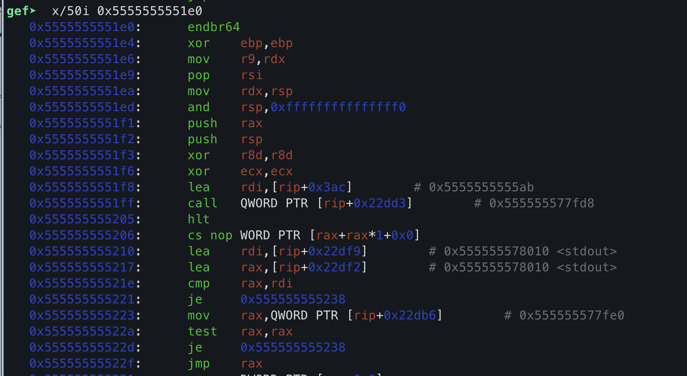

As it turns out, 0x5555555551e0 *is actually the address of `entry`* (you can actually see the call to `__libc_start_main` in this disassembly). This is what Ghidra was telling us all along! This means that this code is intentionally referencing the executable code section and *reading it as data*, and performing bitwise operations with the opcodes themselves. Pretty interesting obfuscation technique!

With that out of the way, let's look at implementing stage 2. A lot of the above assembly is related to a faster form of the modulo operator (from my understanding), so we can skip a lot of it and just look at the relevant results. We need to be able to correlate our code with the asm for debug purposes, since it's very helpful to be able to check the values against the actual binary over multiple iterations, especially for complex functions like this one.

```
   0x55555555532b:	mov    eax,DWORD PTR [rbp-0x18]
   0x55555555532e:	mov    WORD PTR [rbp-0x1e],ax
   0x555555555332:	mov    DWORD PTR [rbp-0x14],0x0
   0x555555555339:	jmp    0x55555555537f
   0x55555555533b:	movzx  eax,WORD PTR [rbp-0x1e]
   0x55555555533f:	lea    rdx,[rax+rax*1]
   0x555555555343:	mov    rax,QWORD PTR [rbp-0x8]
   0x555555555347:	add    rax,rdx
   0x55555555534a:	movzx  ecx,WORD PTR [rax]
   0x55555555534d:	mov    edx,DWORD PTR [rbp-0x18]
   0x555555555350:	mov    eax,DWORD PTR [rbp-0x14]
   0x555555555353:	add    edx,eax
   0x555555555355:	mov    eax,edx
   0x555555555357:	sar    eax,0x1f
   0x55555555535a:	shr    eax,0x1a
   0x55555555535d:	add    edx,eax
   0x55555555535f:	and    edx,0x3f
   0x555555555362:	sub    edx,eax
   0x555555555364:	mov    eax,edx
   0x555555555366:	movsxd rdx,eax
   0x555555555369:	mov    rax,QWORD PTR [rbp-0x28]
   0x55555555536d:	add    rax,rdx
   0x555555555370:	movzx  eax,BYTE PTR [rax]
   0x555555555373:	cbw
   0x555555555375:	add    eax,ecx
   0x555555555377:	mov    WORD PTR [rbp-0x1e],ax
   0x55555555537b:	add    DWORD PTR [rbp-0x14],0x1
   0x55555555537f:	cmp    DWORD PTR [rbp-0x14],0x2
   0x555555555383:	jle    0x55555555533b
   0x555555555385:	movzx  eax,WORD PTR [rbp-0x1e]
   0x555555555389:	xor    QWORD PTR [rbp-0x10],rax
   0x55555555538d:	rol    QWORD PTR [rbp-0x10],0x10
   0x555555555392:	add    DWORD PTR [rbp-0x18],0x1
   0x555555555396:	cmp    DWORD PTR [rbp-0x18],0xffff
   0x55555555539d:	jle    0x55555555532b
```

This is the main body of the second loop, let's compare it against the Ghidra output for a sec:

```c
for (j = 0; j < 0x10000; j = j + 1) {
  j_short = (ushort)j;
  for (k = 0; k < 3; k = k + 1) {
    j_short = (short)*(char *)(challenge_bytes + (j + k) % 0x40) +
                  *(short *)(entry + (ulong)j_short * 2);
  }
  result = (result ^ j_short) << 0x10 | result >> 0x30;
}
```

The internal k-loop:
```
# we can split this up into the two parts that are calculated
# part 1
0x55555555533b:	movzx  eax,WORD PTR [rbp-0x1e]
0x55555555533f:	lea    rdx,[rax+rax*1]
0x555555555343:	mov    rax,QWORD PTR [rbp-0x8]
0x555555555347:	add    rax,rdx
0x55555555534a:	movzx  ecx,WORD PTR [rax]

# part 2
0x55555555534d:	mov    edx,DWORD PTR [rbp-0x18]
0x555555555350:	mov    eax,DWORD PTR [rbp-0x14]
0x555555555353:	add    edx,eax
0x555555555355:	mov    eax,edx
0x555555555357:	sar    eax,0x1f
0x55555555535a:	shr    eax,0x1a
0x55555555535d:	add    edx,eax
0x55555555535f:	and    edx,0x3f
0x555555555362:	sub    edx,eax
0x555555555364:	mov    eax,edx
0x555555555366:	movsxd rdx,eax
0x555555555369:	mov    rax,QWORD PTR [rbp-0x28]
0x55555555536d:	add    rax,rdx
0x555555555370:	movzx  eax,BYTE PTR [rax]
0x555555555373:	cbw

# add together, and set to ax
0x555555555375:	add    eax,ecx
0x555555555377:	mov    WORD PTR [rbp-0x1e],ax
0x55555555537b:	add    DWORD PTR [rbp-0x14],0x1
0x55555555537f:	cmp    DWORD PTR [rbp-0x14],0x2
0x555555555383:	jle    0x55555555533b
```
Here, we can see that `ecx` will end up containing the result of `*(short *)(entry + (ulong)j_short * 2)`, and `eax` will get `(short)*(char *)(challenge_bytes + (j + k) % 0x40)`. This makes it easy to debug, since we can just set a breakpoint after 0x555555555375 and check the values of `eax` and `ecx` to make sure we're doing everything correctly.

In part 1, we're simply loading `j_short` (`rbp-0x1e`) into `eax`, multiplying it by 2 and setting `rdx` to the result, then adding it to the table offset in `rbp-0x8` that we calculated to be `0x5555555551e0`.

Part 2 uses a few operations to compute modulo, but in essence just calculates `(challenge_bytes + (j + k) % 0x40)`, just like our decompilation shows.

After the values are added, the summation is just set to `rbp-0x1e`.

The remaining portion does basically the same operation as before, calling `xor` and `rol` on the output:

```
0x555555555383:	jle    0x55555555533b
0x555555555385:	movzx  eax,WORD PTR [rbp-0x1e]
0x555555555389:	xor    QWORD PTR [rbp-0x10],rax
0x55555555538d:	rol    QWORD PTR [rbp-0x10],0x10
0x555555555392:	add    DWORD PTR [rbp-0x18],0x1
0x555555555396:	cmp    DWORD PTR [rbp-0x18],0xffff
0x55555555539d:	jle    0x55555555532b
```

It pulls `rbp-0x1e` into eax, calls `xor` and `rol`, then moves onto the next loop.

Now, let's look at the script:

```py
def solve_stage2(stage1_result: int, challenge_bytes: bytes, lookup_table: list) -> int:
  result = stage1_result
  MASK64 = 0xFFFFFFFFFFFFFFFF

  for j in range(65536):
      j_short = j
      for k in range(3):
          challenge_byte = challenge_bytes[(j + k) % 64]
          signed_challenge_byte = ctypes.c_byte(challenge_byte).value
          lookup_val_signed = lookup_table[j_short]

          # add the challenge byte to the value from the table
          # read eax and ecx at 0x555555555377 to check
          j_short = (signed_challenge_byte + lookup_val_signed) & 0xFFFF

      # XOR then ROL the result
      xored_result = result ^ j_short
      result_after_rol = (
          (xored_result << 16) | (xored_result >> 48)
      ) & MASK64

      # read rbp-0x10 at 0x555555555392 to check
      result = result_after_rol
  return result
```

With this, we're basically done, right? We've fully reimplemented the verification function, which wasn't too hard (famous last words).

Our last step is extracting the lookup table. Normally, we could just use glibc `rand()` directly and just generate it on the spot, since we know the seed value. In this case though, I was testing the solve script on a Mac, and it turns out that `rand()` using macOS libraries is not same as the function used by the binary (I tested on a Ubuntu VPS later and found that it was using the same function, but it wouldn't have made much of a difference). 

A better plan would be to simply dump the table from memory in gdb, since that will automatically include all of the opcodes that need to be in the table without the potential human error of manually adding them to the top of the `rand()` table.

We can simply set a breakpoint at `0x5555555552c9`, then call

```
dump memory memdump.bin 0x5555555551e0 0x5555555551e0+0x20000
```

to get the full table in use by the process.

### Rabbit Holes

If we try and run the script, the binary responds that our value is incorrect. We can somewhat expect this to happen when reverse engineering, which is why we spent so much time documenting the assembly!

We can check our result each iteration by setting a breakpoint on 0x555555555392, then reading `rbp-0x10` with our previous command that will show it as a `long long`. As it turns out, our script is actually correct for the first several iterations! We could technically write a script that will generate a list of values that the binary is generating and compare it to the output from our Python solver, but with 65535 iterations, we can binary search for the point where they diverge in a maximum of 16 tests, which will likely end up taking less time than trying to automate it. As it turns out, we diverge at loop index 217; the first 216 operations produce the correct result by the end of the loop, but we produce the wrong number on loop number 217.

After quite a bit of poking and prodding at the assembly, we deduce that our `ecx` value at the end of the loop (the value generated from the lookup table) is different than that of our script.

Here, we stopped at instruction `33b`, which pushes our current loop index as a short (the index that we read from the lookup table) to `eax`:
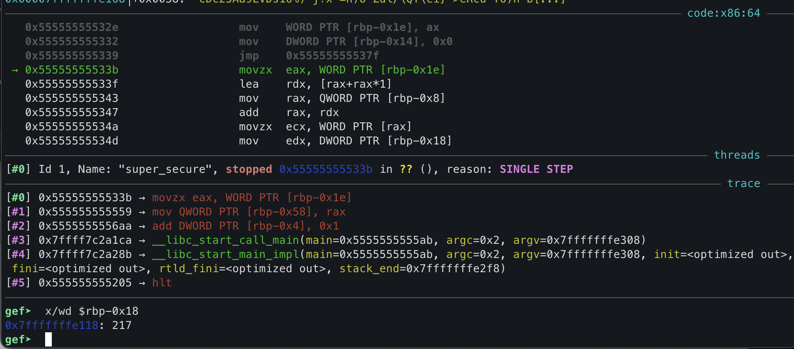

And we can verify that `eax` does indeed get 217:

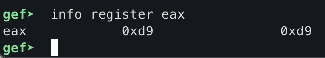

The next few instructions multiply `eax` by 2 and store it in `rdx`, as we discussed previously, then essentially advance the lookup table pointer by 434, getting 0x555555555392.

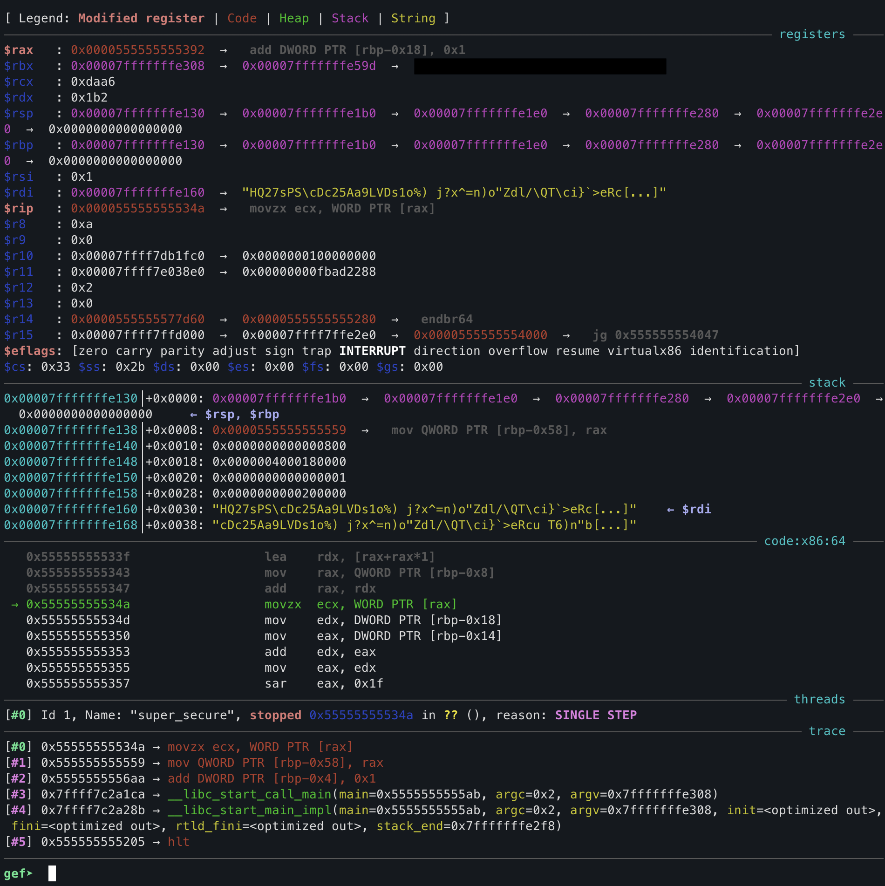

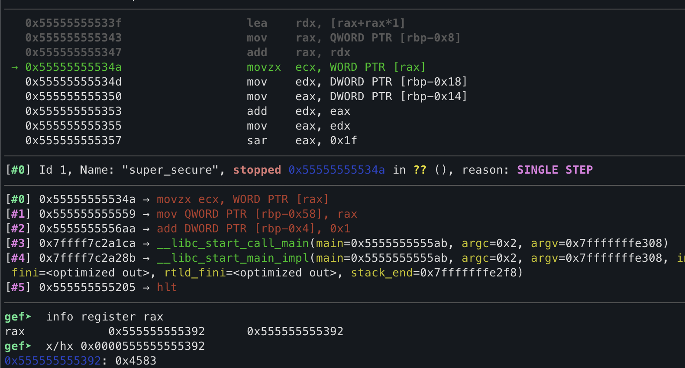

Now, `rax` has 0x555555555392, and we are about to read the value stored at that memory location into `ecx`.

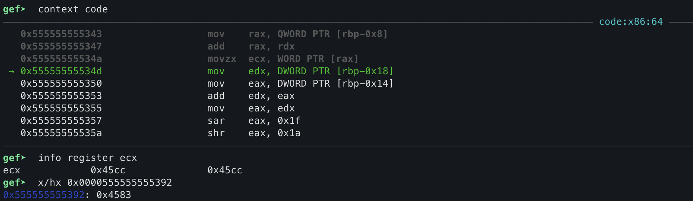

What? The memory dump clearly reads that 0x555555555392 has 0x4583, which is what matches our dump, but `ecx` gets 0x45cc! At this point, it's somewhat obvious that we would diverge here, since if we don't correctly have `ecx` set, that will propagate through the rest of loops.

This stumped me for quite some time, since I had no idea how a simple `mov` could put the wrong value into memory. Let's turn our attention back to a bit earlier in the writeup:
> We can check our result each iteration by setting a breakpoint on **0x555555555392**, then reading `rbp-0x10` with our previous command that will show it as a `long long`. As it turns out, our script is actually correct for the first several iterations!

Notice anything about that address? That is the address of the *opcode that we set a breakpoint on*! This took me much more time to realize than I care to admit, but in order to create breakpoints, debuggers will patch that memory location with an `INT` opcode.

From [Wikipedia](https://en.wikipedia.org/wiki/INT_(x86_instruction)):
> The opcode for INT3 is `0xCC`, as opposed to the opcode for INT `immediate8`, which is `0xCD immediate8`. Since the dedicated `0xCC` opcode has some desired special properties for debugging, which are not shared by the normal two-byte opcode for an `INT3`, assemblers do not normally generate the generic `0xCD 0x03` opcode from mnemonics.[1]

This perfectly matches up with the behavior we saw previously, since we overwrite the `0x83` byte with `0xcc`. This all appears to be somewhat of an anti-debugging measure, since a breakpoint *anywhere in the program code* will cause this behavior, and just make our solve script diverge at a different point due to the instruction patching.

The kicker here is that even though we exported the memory dump with the "correct" values, the solve script still doesn't work when running the binary outside of a debugger, so we must have an incorrect memory map. I spent way too much time here trying to debug the script itself before realizing this, but alas.

The main thing I noticed at one point is that location in memory where the actual random table starts was zeroed out for 8 bytes contiguously. We can see this in the initial dump I took starting at where the actual random table starts, as well as in the memory dump that incldues the code section:

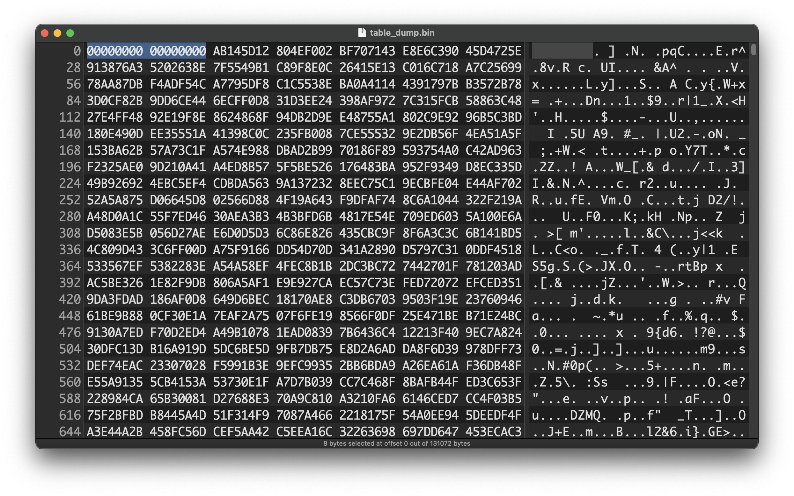

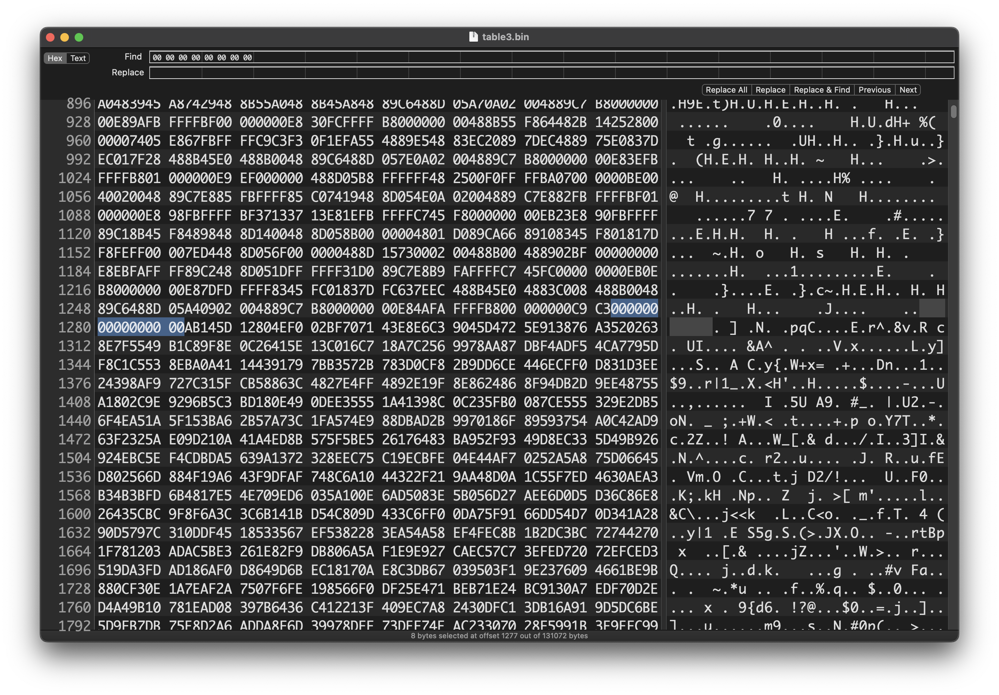

This heavily suggests that more things are at play here, since it doesn't really make sense for that area to be zeroed out, and we're already on high alert for anything that we may be doing debugging-wise that is causing us to get an incorrect memory dump.

### 🚨🚨🚨 More Protections

We said we were going to come back to those alarms, didn't we? At this point, we know that there are at least some shenanigans in place to make debugging harder, so it's about time we take a look at the alarms as well to see what's going on there.

I completely ignored this earlier, but `_FUN_001016dd` is **a pointer to the start of the random number table**!

```c
_FUN_001016dd = 0;
signal(0xe,FUN_001013ea);
ualarm(5000,0);
```

This is getting set to 0 right here! We then create a signal handler for signal 0xE, which just so happens to be `SIGALRM` on most systems. We then create an alarm with a 5 millisecond timeout.

Let's check out `FUN_001013ea`:

```c
/* WARNING: Globals starting with '_' overlap smaller symbols at the same address */

void FUN_001013ea(void)

{
  signal(0xe,FUN_001013a5);
  alarm(1);
  _FUN_001016dd = _FUN_001216e8;
  return;
}
```

It appears that this creates a second alarm with a timeout of 1 second that executes `FUN_001013a5`, then *sets the first 8 bytes of the random number table to* `_FUN_001216e8`!

(keep in mind still, these aren't functions, Ghidra just interprets them as such because we keep editing data in the code region)

That address looks familiar, let's peruse our previously decompiled output to see if it's referenced anywhere:

```c
undefined8 main(int param_1,undefined8 *flag)

{
  int temp;
  undefined8 uVar1;
  time_t temp2;
  int i;
  int j;
  
  if (param_1 < 2) {
    printf("Usage: %s <flag>",*flag);
    uVar1 = 1;
  }
  else {
    // mprotect
    ...

    // generate table of random values
    ...

    // aha!
    _FUN_001216e8 = _table;

    // reseed with system time
    ...

    // do the challenge!
    ...

    printf("Congratulations: %s",flag[1]);
    uVar1 = 0;
  }
  return uVar1;
}
```

In our `main` function, `_FUN_001216e8` is being set to `_table`, which is the exact same thing as `_FUN_001016dd`. At this point, we fully know what's going on with this first alarm.

The binary:
1. Generates the random number table at `0x001016dd`
2. Copies the first 8 bytes of the table to `0x001216e8`
3. Starts a challenge
4. Sets the first 8 bytes of the table to 0
5. Sets up an alarm that will call `FUN_001013ea` after 5ms
6. Restores the initial 8 bytes of the table from the copy

For whatever reason, this alarm was not executing in my GDB environment when I was first testing. It's possible I had SIGALRM trapped via a GDB config, but what we do know is that those 8 bytes should be present with the correct value.

Let's look at the second alarm now:

```c
void FUN_001013a5(void)

{
  int iVar1;
  int local_c;
  
  for (local_c = 0; local_c < 0xffff; local_c = local_c + 1) {
    iVar1 = rand();
    *(short *)(FUN_001016dd + (long)local_c * 2) = (short)iVar1;
  }
  return;
}
```

It appears that this will essentially rewrite our random number table, but crucially, it uses the updated, time-based seed. It's pretty clear that if this function executes, we lose the static random number table completely, and it'll be very hard to try and reverse engineer the new seed.

Importantly, creating a new alarm *replaces the previous one*. If we solve the challenge in under 1 second, the next 5ms alarm will replace the old 1s alarm that overwrites the memory, so all we need to do is answer all of the prompts within 1 second. This also presents a bit of a challenge for dumping memory, since if you take too long to read the process' memory, it will overwrite itself with different data. Another debugging protection!

We can now properly deduce that running our binary in a debugging environment will *probably* produce an incorrect memory map. We could, in theory, figure out how to get around that, but there's an easier way to get the true process memory: `/proc/[pid]/maps`.

This file contains the real, runtime memory mapping of any process on a Linux system, and we can then use `dd` to dump the memory in the location we want. To make this a bit easier, let's disable ASLR on our test system:

```sh
sudo sysctl -w kernel.randomize_va_space=0
```

This means that we probably don't even need to read `/proc/[pid]/maps`, since we already know the addresses of everything from GDB. All we need to do is watch for the `super_secure` process starting, then immediately dump the memory at `0x5555555551e0`. As long as we take longer than 50ms and shorter than 1s to complete the read, we should be fine.

```py
import subprocess
import time
import os

PROCESS_NAME = "super_secure"
TABLE_START_HEX = "0x5555555551e0"
TABLE_SIZE_BYTES = 131072
OUTPUT_FILE = "table_dump.bin"

def main():
    pid = None
    while not pid:
        try:
            output = subprocess.check_output(["pgrep", "-f", PROCESS_NAME], text=True).strip()
            if output:
                pid = output.splitlines()[0]
        except subprocess.CalledProcessError:
            pid = None
        time.sleep(0.01)  # poll every 10ms

    print(f"Copying memory")
    # wait for the memory to get cleared then re-copied
    time.sleep(0.020)


    table_start_address_dec = int(TABLE_START_HEX, 16)

    dd_command = [
        "sudo",
        "dd",
        f"if=/proc/{pid}/mem",
        f"of={OUTPUT_FILE}",
        "bs=1",
        f"skip={table_start_address_dec}",
        f"count={TABLE_SIZE_BYTES}",
        "iflag=skip_bytes,count_bytes",
        "status=none",
    ]

    try:
        subprocess.run(dd_command, check=True)
    except Exception as e:
        print(e)

if __name__ == "__main__":
    main()
```

This should allow us to dump the process memory via `dd`; we basically look at the memory mapping of the process, skip to the index we care about, then copy out 131072 bytes, which we previously established was the size of the region of interest.

### Solve Script

With that, we now have everything we need to complete the challenge! The following is the overall solve script with everything put together:

```py
import sys
import ctypes
import struct

from pwn import *

TABLE_SIZE = 65536
TABLE_BYTES = TABLE_SIZE * 2
MASK64 = 0xFFFFFFFFFFFFFFFF

def load_lookup_table_from_file(filepath):
    with open(filepath, "rb") as f:
        data = f.read()

    lookup_table = list(struct.unpack(f"<{TABLE_SIZE}h", data))
    return lookup_table


def solve_stage1(challenge_bytes: bytes) -> int:
    result = 0

    for i in range(64):
        signed_char_val = ctypes.c_byte(challenge_bytes[i]).value
        result ^= signed_char_val
        result &= MASK64

        high_bit = (result >> 63) & 1
        result = ((result << 1) | high_bit) & MASK64

    return result


def solve_stage2(stage1_result: int, challenge_bytes: bytes, lookup_table: list) -> int:
    result = stage1_result

    for j in range(TABLE_SIZE):
        j_short = j
        for k in range(3):
            challenge_byte = challenge_bytes[(j + k) % 64]
            signed_challenge_byte = ctypes.c_byte(challenge_byte).value
            lookup_val_signed = lookup_table[j_short]

            # add the challenge byte to the value from the table
            # read eax and ecx at 0x555555555377 to check
            j_short = (signed_challenge_byte + lookup_val_signed) & 0xFFFF

        # XOR then ROL the result
        xored_result = result ^ j_short
        result_after_rol = ((xored_result << 16) | (xored_result >> 48)) & MASK64

        # read rbp-0x10 at 0x555555555392 to check
        result = result_after_rol
    return result


def solve(challenge_bytes: bytes, lookup_table: list) -> int:
    stage1_result = solve_stage1(challenge_bytes)
    final_result = solve_stage2(stage1_result, challenge_bytes, lookup_table)
    return final_result

if __name__ == "__main__":
    port = 1337
    
    lookup_table = load_lookup_table_from_file("table_dump.bin")
    conn = remote("challenge.ctf.uscybergames.com", port)

    for i in range(100):
        conn.recvuntil(b"challenge: ")
        data = conn.recv(64)
        print(data)
        assert len(data) == 64

        answer = solve(data, lookup_table)
        conn.sendline(str(answer))

    conn.interactive()
```

We set up a quick `pwntools` section to automate sending the data back and forth to ensure that we stay under the 1s-per-challenge limit, and we can run it and get the flag.

```
$ python3 solve.py
b"' 0_et0W!nc`7{}35^,,tuLLcIFQ)8@JRj+9z;,{E+]]BvpWV9cf0L5/u[z:/Ve{"
solve.py:133: BytesWarning: Text is not bytes; assuming ASCII, no guarantees. See https://docs.pwntools.com/#bytes
  conn.sendline(str(answer))
b'B,PXbvU)#OfFGY9:.}"XeQgvH MqVNn5Z@m>8_HV0J|q%QGMjJ\'Q7+dz+3maax2W'
b':"vm{ZEG&]:F0bs{H7hyBNuM{!Jxy]R5yd>v@c?`BsBmWR&;inQ-YHtVI@Q^9?t4'
b'%NF_4eAp[ _NR!&=,Wde;ZW!6D_Pco $@GcT.A`%A\\ns]t2iM2j$l^%$$!n$poBL'
b'R(<`I}"j[pyTfGZOYFmG&/eE0Vc<a\'i5/\'1r@3^{?slA<H,u*zXK+@pU2oqsv\\DB'
b'dU6&%1>D&F"Cn.T4D/_iOk@a\\4pUp63p\'c3,0Qk73mt#{dQ\\s3GD hA]|MN*}{{\''
b'`0Mq{:D0)TMA: }0M`nNJLGby1m5.&<n6i{M@A]I1F&L`?\\0"f^f4AKJRT_zZ{&p'
b'"$?B_8(qx.?Zh7jj}dlNA9xsmY+Ip2UrP0Q1bY>\\#w9kJ?qd@`4a5.q%g|hsJZ#z'
b'jTHiI"Ggzzn`VbFv^ZYshL4ke}`1Y H_TpJ:..#DDq\'zoMrODhE.PY67r2cg2-c#'
b'9/WaWZ(|g/4Yv)D<-ie]_{1mItWv=<5pelS?buWK&k@}0eU=j<7eSHU9X.11dF=K'
b'N,&2$]w*K:Cu;55AQfC\'0x@$Bk5(Mlm{xt/|SBC:\\"L37aoic4,sHf3jmH.<6{9J'
b'qbIa&l7}ncLB`=-EkST5Ug!DK/`{G5H:3q79yOR%N!G1XnpFCGu40wXvBTsi%W@8'
b'JWl_B@e-[.>P9Jv\\q)->"e6_VEJ[}&tcxbE<>,czT#LmN^f[gs5&tKef-KD,lTof'
b'RP>pv$(MAnV+hX#lg8r^ s`-Z&9btDJHu%UmCwVdhI,l#/ZkGheGwGTTN)R^h})y'
b'>x$aq[Gu@mdC|Z0FE1)>Yx.C=a#\'z,":&\'74|x+>h+aff.H-?le4f0W%-[-C#IwD'
b"P0XN*c(r+&uqN? m-!$/K[5XR\\{V'tzX@TBKSKY^kPk;p'D9)HIT@^I.<Fd]Wz7w"
b'jtDZ[ :HjBc\\I)2Rl[CHUlp-NWj\'S>;Z4_6+yjS".RxXu,F}#iGXqT!B-(czF Vt'
b'zl!1sn3#B.[9:$9X)zL7jNYwVX08Y"Ho+I" 96#u^yJ49}l\\6;s"%h6uCF/|bW)m'
b'<+)o[-"UBLj[Lr9bI/ Nw6_Vv*n[{wd9%nDz7FRYs>P[L%?v4Y`HpB hL+EJ$F})'
b'6D@gjrByL.Vx31,bkmF]K`awkC]pi]5;=U$CIF?un1,#C8eJAGCl*&"uIygNr}i1'
b"Tmo O01?A=] p^J3(m<2tX)YSq*Hpss`}dzN0.*RegRqa9'i(]{87ArjN8NZ-D<F"
b'D9uUa;)H>u<!0]kS<$kmE_ss3DO[$(#HA4}$OBfm:>od{vSSzA\\\\<RkPvW-z_0D<'
b'_DZ0"B:<a+=x#ph9MFujx}VpVc(7/gmnGI;I\'U"hz?}}KgRyId!DcWP;VYl!B[,%'
b"&GN-8P24oKMWN!RwemWdF*!8})S[d_`&B0NZ{znla=_1YMD@<|'|BBP[f&Rfe4)*"
b'^W [modPHE{#/[^KY!J7CzrE<F.$t7Ho*bfwSLc8.z;=Wy$M6hdt!s;=;I[L`%=j'
b'h%}Wl|+z4aSlvW;/B;%C0@zL&X4"]Q)aV(U^AzZU]I]V=xeyPjX`FTHL.\\O(/X%"'
b'zt`=qW/P<l(Y#)nSsH5V}x$GVmO"aU>^K:7Xq`+JOM?lW0[fX,Xq&];]fjyJ[9DC'
b"S[{a>B-),f1}vlekx@^!95x;<se3.+Va#n^[Lk XT1Wf}YSw5N4hc.%;#'OKL'Ii"
b'1)F^1F8eq,gp!=&6\'::&c?B"`qN/43xF<[&M=XN1d8=!o]7v4Q|w-@ymMc8bvM*O'
b'*J8a>gr?;L@,+X>?EVRlwNv`M0D`wh1=NI!mL/.g[N/#BM\\$&1p9yh5H5Z*.^Uf/'
b'!g8gvFQn0zqmdOq&z}Yu$n@9JdaE<InWL(@Eh-O4*\\#n-t0D0i;4Y[M@BJex0oQ\\'
b'w-#{;l1_J5irEy8U SiY1Rym}z#/kn\'d{E{R3/M^DRR%gj[g?`Cj5XsNU2wB" C:'
b"E@lsiVSI*AOr-F[f(:mWs|'d1:B3;eMzBVoG.^qR!\\`H$X1Fr::#8[gcv,3M-zci"
b'RUMz5@iQ8KyV%F|4`R750;xBaG+*Dn02_]I194bQy]);&AOft"7@WL|:s)_93ofs'
b'N1&#_$TZa]ug:Fj0c=j<ihWy-R4[CzP-Gp0(tdcq]tuwW{D<:0X@5K;\\}i9\\"%iI'
b"u5R'5QyrGp( )fVC2KcG2:@L&s*(y0k,EYN[,IinUq*^s{=(H=iZW+(w!M;6])B$"
b'bpy+UeyFr?&h<^,d7u[*#}$>LYT+bvJa%ElZF##UBCY_=e_T\\<_yV}9$X)0W<t:A'
b'U(7|E:mgxHb7/^(\'6#=l<Vqtz=g83#YhE,"ja+n[SR.|2P@IS]QoOD"Kaic0)X5h'
b'eQoH]_?2MgK`:kE)dv55W7aT<`e_UzJ<M; ,6YYcB@_v-&"q97B,h%`@"G<W]f/G'
b'=/mS$HR`h4Y1:u>mHa5L"vl$Y*u9,&zcOiRSN\'68;+do<>yd!0L>(:\\|_TQ\'ZMk,'
b'8?y"`1U{V;mrYhru4@OWu-Up{(wXo  )Zy,<Ga:}8C.-G">[]m4T7%FN-Y(|ZBB6'
b'XhR!e(:9eHF.e!&^nT4AZtp#i4<EWxu1bdLclf|nK^8L_X,j/Z-%j9BUh^{ArrlV'
b'rTU{<mk#N%OI^u5)Q]H=2j/zeF=YTELIy#FR-3o[R[&LRVU&5}]G&lDk4{Fi].4r'
b'Lt`Y)R6[/V*{Hy#]5{A;%!BT8$Y13m@_}":(nj}9\\C7\'?T nQ[Eq\\gG1\'"BT+bO*'
b'!%2ooKEho\\oJ2o: MyqE|:V%V5ta3Ek4K9@V e@o]1Uo=o+&&|K$R>D*m:k<_rQF'
b'G-}H.?Skk+vD6$J="1AoieyX;#u{1bCY+B#9|p@%{8I4V/ks@.dF0y:K|1b0/(%T'
b'dB)|4I#2|L`nuMc8uc^\'_xmwFQCosHFZjir;5vgM^I=Vv=*m"h1{| u^kTPa}2W%'
b'{KZLCC5>lm0 ,:nH>;F<UW{B-g%F5\\f2DBygf0An}QoEky*+6jbkCy/jbOMwG5Ek'
b'q@osk2d& UfkPp3f\\um;p8AT#ngK?H8MiCBpV(vV]x]/jp1H# csSAcV1f#k1V:z'
b'y\\(ke:]D5=n!I!dM<c\\o&BGR*e?;=YQR7sZ809wEpg`<$F%@FaKL%/ JtY!M4S!f'
b"H[:r13S#z6Y!v^[>\\)'{8AGH7cuK82Mz*h+;{^X4t4O).,a&5$$gFe1]J(D|U.5_"
b'2@6I *]1X.:#;7)j<-T|seuY*UX_cmZ1/,[I6TZoc0r:H{@ Et|Tv//<dg7dpqu;'
b'9leOC[ZBlhvP"8jGIh7[3FwwJ0wV=+rVwsAVP|xXf,D$E0K*4|!GEx[+DTa{_USs'
b'd0K7.`+1lP5Mz{WKyXrZlieLZIIU:8J!I2RWrw$`cT0`k#-"v;]d\'^3aCv8x1}5Z'
b'1gM%`l!`B1BIOiKG@D-G%ZDHSw\\d2qZCZ)bWu}9SKu|zzJC<nj /G^r6qP6%Dpb:'
b'5`--```-q_CmEf,ORF_5&me4?{9})8:?xaLtDH#7CFA$HgT7/OfO>Nc]e}]o730K'
b'tvBT@_(dBIhj2X=A)&,GnpAU+:F\\MV)]NeN+GV+i!so3hInqOzU?lv032WoyI5rx'
b'zB?]xJb5YTbC9R7hilCq S\'2F2GpG;&D^E#ro"DJV(*+uA/`IRmcA0u$C>t&s6JS'
b"uhbfj(L\\0V#A32=v -[A=R_z,o#<'g+|km q1Mi\\?l}S =K dC\\=1=:X/WtP@!O."
b'+i;<R\'xrs4a0QH07k(T}F*WoaMA$h,Lsv#2d*FX:Z;J-dt^Q}Oj_YCj=,G[unCj"'
b'F8fk_AA;vkc\\{CJ6.P1ht{A"_83O[ Q=8SDwteOmR4ejWK<f|Nj.eGJF_^1V^|s2'
b'R:,H![QnoStb:2d8zj`b3-DrkpJKnZ]B0%kKzXUk-ejHxjz0W].j&S_qEEXO;QrK'
b'Wy3SS$[{ja_ Mu0&nYqtHlg)MAXisLPfGcU7$24n//*]&:}us,k=xoFbL;M[g}CK'
b'}yb=Gv-WA7PGkOX{v`T,k7n9R=u;WT"pOd/3vVj9mV{t\'o-}Qb,Xy6rgT%>GYA9+'
b'\'bX :DSC6P9=BGW/E}hZ5vC%{{LV>!{`cU`95O\\K"2%^Yv):1qtF%Sf"PNsoPpQO'
b'bMiw|G_:Y 4Nv>$)KxiQMQS <b+lUvW9_BLw&G4yGbdY<h|h}$ULoDf-)-y^%S3d'
b'1yx7]HM@,3zI{4Mz8$cDHeQksgK4Vx5g0/;mWh/c7EHNtuK.5Jl^1@e@)3UyG&bq'
b'59`l=,kTk6%aGj,]PxW{:>>]k/XO5WBd,?RJKY R+?6SEBLuV%s-]MjK\\_6-8XqD'
b'3_*^TEM`dc5,A{=w"2&yy-`Wlv @k-  (+y]PHYP-nvh\'6a)b$$^1eQ9wlYdyYe>'
b'd`7PDp=Qz5;#e8FJ<JDgKu"_c[EyQFSQBj$f\\A9rpnuXC=>_#bciYeJY]on08Cat'
b"I!]A\\25O#,C`ca[fE@k:B7s!)}1[\\.Q'JJb(]wWz?z\\>]9'>ZrY|Fh9ihdF`.3$X"
b"^faWzTS;k1Zdd{%Z+^rkb-Vfq8I<LgtFOW9eHl#59wy}0:ZU4NCw\\y_i4D'z-8\\w"
b'ou^S}{h80 7@:-2O\\UHTjCY:h{Pu5Hn@YitXf^,w^DSyQedIV.}]QY3UV MkHW-$'
b'\\=vE|%Xvc--6/qz!;yx)nH^`HGgp;10wN)>L.v_q@lCiz?&7U;@_c;B-b+9}<Jwk'
b'mQS7d4D&=g+9CKP4f-sKHQr,].,5r?<appxV@>v]A#v icNQp^9:1-`nU(@IG\\F:'
b"h@,+x%$<B{V-z'_le4Bv[>#3G]v*;?^&_k1tpOL4L$\\bE=jFkHYHgv[0UnTp/5v*"
b'"C ./f\\uk:ZLqFs^oNCX`:$7*r)9)<^EyxS*aL"hfv6t>ETI/w=o4[(XPL.s$l;}'
b'"*DcV`gYX:O2_?v+S56gq?[]\'iR+q)Dt4$Y& ]_XwJ\'Xj}}?N6BAo}:vi)=\\2{R`'
b'<Hg<\'b1 /8ryQr:!*v]yuw-`"dYOaG1}o4V2wgLB;A=lOq)Yifn``7]|{Rgxyy4\''
b'Ij9\\Sf nCWvrJ!gOhqLd*E|Awf;.{O5F;i%*k%x0]p$Cr\'svx[\\>"Z_5B6C?fY"='
b'^\'HK,\\[%Oyc]<rU6OMTk)O"feEAg:C\'xdi_-G<22Qu+miz?TI/Am^Co`%2IYpjnV'
b'oOc9(2eYCqcIm$}SN[B. 3*?_TyQZiDL:CeBUf85s7^cUw8%TtNo)X0$HEV%06Qe'
b'YRC1:uF0.@/d9a%*WSyz.E pkpu7(H8b6\\/kmo781F|dC=n6qi2;1L-8?%OaghE:'
b'`T\'O_>gp !WCYaYLM\'#xS02.OapSeQmGBt3#460NR#q-dfs3)vGvBY\'rW3G> 6"B'
b',O`Z!pDmsQzY9+)\\#PTFFuT}*{WEMsgs^Ii`U/iJ`f@5-cqKOG-u?a0c^$*G3.<r'
b'q\'nI6Y/v[O-iN 6 aCu"@B":F,aY:}g.&qq<M"NDl[/<u_VX>hu^,wxl%uaZtK$z'
b'>uR\'3"L;wuXnqJc14Z,@m@Hr8,hHq(EK}wSM6;h/2\\:?)9Q=/wx|SB,\'NuPA}1)9'
b'DvfZ3j&_IZ!Rslo$ei"T..\\v?HTYY]r9Utt$`6c+pdweRi%SnAD8O<K+d!dYxrri'
b'$$md:l,,S%-A*L1ymoMY-xd-yd"/r0xv5#vip$2_DY<N(gcuX3P!-P.C6Jl*[g<,'
b"&5uvS)q3}0b'wa|l0im>;|{lHi2?lOKs C'Sf5#!E!(XbAFs,6MaNdO2ibRXM9gM"
b"v*<y??z @%Y?F;4lk{O;a;hf}V@foCOhh'}CGyD# 9\\`T,hB):w&Uamn9IpE)A/q"
b'H.6+CtI^/\'Z NE\\qyUxjS#t(ffMo)v|k@O3d_\\D+} +gE#[@roFG.<jt$9"G2:OR'
b'%bReZvps37]X::5H+[,94vI81ez]"KL\'I (%34xFKq:!-OdRGp\'[hQ/58EsTp[\\U'
b'[ Zn5oPzbk8,V|^}n"trS@)\'e|\\rYTcQnZ[%K.<I5Toklj\'vl7j[W/bYHZg=JLn;'
b'(fZS0v9Ef*2nt9f|QlYD|>}`4f}_5n6=pp-"%`G\'&Y27/45`#o&;/@{](z>W&Tuv'
b'a>4" [)@7;WFPmBm^bD)$[f-q\'dxuu,rO[ti8:,iocK[RmdLl*Upe>}YE mV15Ka'
b'p[fEur0gr\\^`eE/mOd`Q$yFcy5VGd#DW^,|p;Hs/@S+B4:1 ;qQYmwY$H1K.NoeH'
b"|}:9HIbh9m,MD>MyK T:3I?[Z&j*vkS0')ciSGSlPz;0T%+!%zVSE10<76F/>5?E"
b'?$0.e}6R5Qb%V*\'v&wKe*u#A.dQf5,-nKW|2p4 ("c-r)N&IGQ0QcN/-N`sc(<TS'
b'/R"!#"C%ek3nU:S9\'d&jN5w|u(a:D7mS&ooCrNHs;u -1SF9SL%#b9!sA}/"P9Up'
[*] Switching to interactive mode

>Congratulations: SVUSCG{8ccb96ace98cda5f49b690e5695481aa}
[*] Got EOF while reading in interactive
```

### Flag: `SVUSCG{8ccb96ace98cda5f49b690e5695481aa}`

Overall, a very cool challenge, and I learned a lot about debuggers in the process!